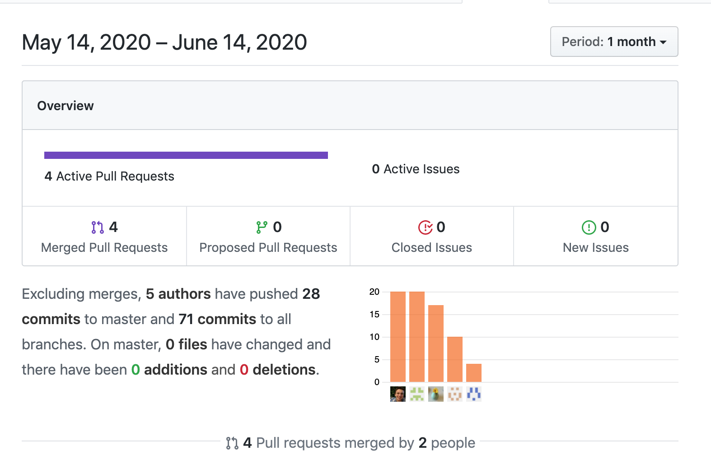
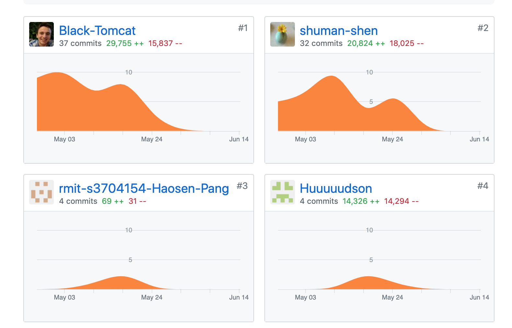

# Project Structure

- *pi* folder
    
    - *master* folder/package
        Master Pi program, lauched by `master_pi.py`
        
    - *agent* folder/package
        Agent Pi program, lauched by `agent_pi.py`
        
    - *voice_recog* folder
        Stand-alone admin voice search console program, launched by `main.py`
        
    - *docs* folder
        
        Sphinx documentation
- *web* folder
    Web app frontend in React

# Contribution

-  Thomas Frantz
    - PART A: Master Pi web app frontend
- Jacob Morris
    - PART C: QR code recognition
- Haosen Pang
    - PART B: bluetooth in AP
- Shuman Shen
    - PART A: Master Pi web app RESTful API
    - PART B: Master Pi voice search

# GitHub History 

# Trello Usage

